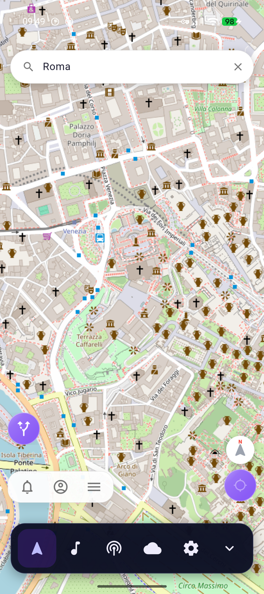
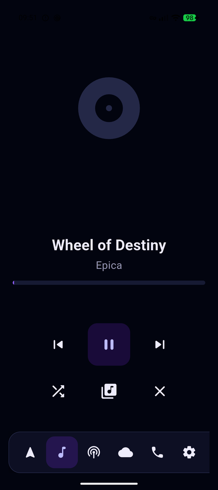
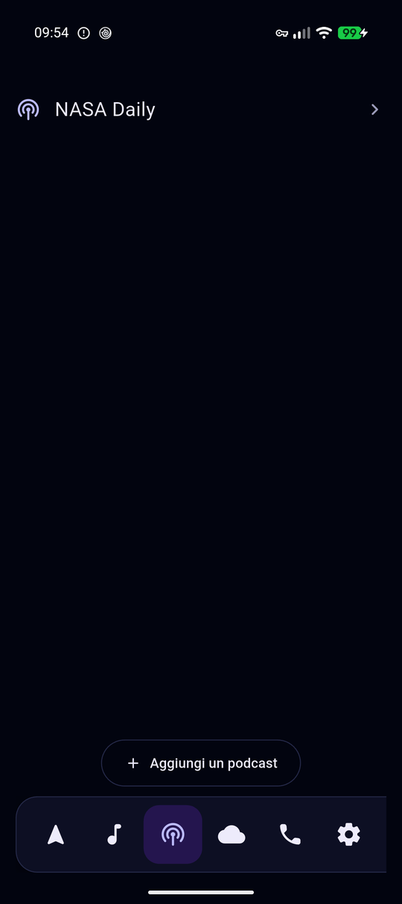
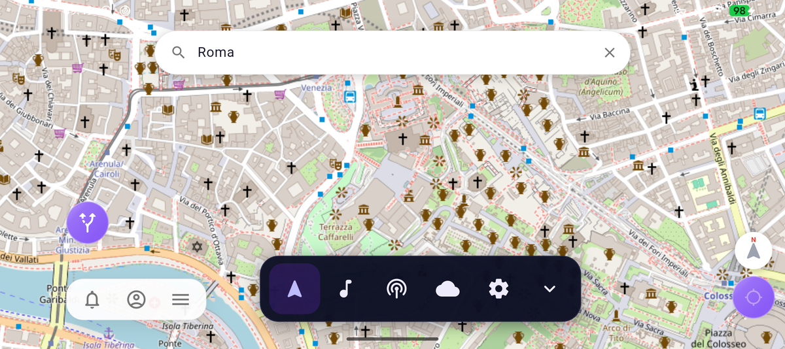

# Voyager

**An automotive dashboard for Android, built on [Roadstr](https://github.com/roadstrapp/roadstr-app).**
Navigation, music, podcasts, weather, voice guidance and phone — one screen a
driver can read at a glance, in a phone mounted on a dashboard. No account, no
telemetry, no proprietary dependencies.

[](LICENSE)
[](#requirements)
[](https://flutter.dev)

---

## What Voyager is

Voyager is a **car-mode dashboard**, not another navigation app. It wraps
[Roadstr](https://github.com/roadstrapp/roadstr-app) — a free, OpenStreetMap-based
turn-by-turn navigator — and puts everything else you'd otherwise reach for
your phone for (music, podcasts, weather, the next spoken instruction, an
incoming call) into the same full-screen, glanceable surface. One floating
control bar, large touch targets everywhere, and everything that doesn't need
your attention right now stays out of the way until you ask for it.

It exists for one reason: mounting a phone in a car and running a normal app
on it is a bad experience. Text is too small, buttons are too close together,
notifications steal the screen mid-turn, and switching between five different
apps to change a song is not something you should be doing at 100 km/h.
Voyager fixes that by being the *only* app running on the mount — everything
else lives inside it, sized for a glance instead of a stare.

## What to expect using it

- **One dashboard, every orientation.** The same floating control bar and
  full-bleed layout in portrait and landscape — nothing to relearn when the
  mount rotates.
- **Navigation is Roadstr, unmodified in substance.** OpenStreetMap maps, OSRM
  routing, speed camera and speed-limit warnings, restricted-traffic zone
  (ZTL) alerts, and community road reports shared over Nostr. Voyager only
  changes *how* Roadstr's own controls are laid out so they never collide
  with its own chrome.
- **Music plays from wherever your library actually is** — a self-hosted
  Navidrome or Jellyfin server, or files already on the device (indexed
  through Android's own MediaStore, no separate import step). Playback is
  gapless, exposes steering-wheel and Bluetooth AVRCP controls, and has a
  five-band output equalizer with genre presets (rock, pop, jazz, metal,
  hip-hop/rap) alongside driving-specific ones (road noise, speech clarity).
  The now-playing screen lives only in the Music tab — it never floats over
  the map.
- **Podcasts are a separate tab**, not a music sub-mode: search the iTunes
  directory (no account needed), subscribe, and the episode list is capped
  and cached so a two-hour show doesn't stall the UI. Podcasts and music
  share one playback engine — starting one stops the other, the way a single
  output should.
- **Weather is Open-Meteo**, queried with coordinates rounded before the
  request leaves the device, and flags conditions that actually change how
  you should drive (ice, fog, high wind) rather than just showing a forecast.
- **Spoken turn-by-turn guidance runs entirely on the device** — Kokoro neural
  TTS where the device can run it, eSpeak-NG everywhere else. Nothing you say
  or hear is sent anywhere.
- **Phone calls and texts appear as large, glanceable cards** layered over
  whatever you're doing — no dialer, no contact list, deliberately. Answer,
  decline, or read a text without hunting for a button.
- **Nothing phones home.** No analytics SDK, no crash reporter that uploads
  by default, no account to create. The one network calls Voyager itself
  makes are to the servers *you* configured (your Navidrome/Jellyfin, the
  podcast directory, Open-Meteo) — see [Privacy & security](#privacy--security)
  below for exactly what that means in practice.

## Screenshots

<table>
<tr>
<td align="center"><br><sub>Navigation — portrait</sub></td>
<td align="center"><br><sub>Music</sub></td>
<td align="center"><br><sub>Podcasts</sub></td>
</tr>
</table>

<br><sub>Navigation — landscape</sub>

## Requirements

- An Android phone or tablet — a dashboard/windshield mount is the intended
  use, but nothing stops you running it handheld.
- Optional: a self-hosted [Navidrome](https://www.navidrome.org/) or
  [Jellyfin](https://jellyfin.org/) server for streamed music, if you don't
  want to rely on files already on the device.

## Getting started (building from source)

Voyager consumes Roadstr as a source dependency and expects it checked out
next to it:

```
some-folder/
├── roadstr/     # github.com/roadstrapp/roadstr-app
└── voyager/     # this repository
```

```bash
tools/prepare_roadstr.sh     # required — and again after every Roadstr pull
flutter pub get
flutter run
```

`prepare_roadstr.sh` mirrors the Roadstr checkout into `.roadstr/`, applies
Voyager's own UI patches from [`patches/roadstr/`](patches/roadstr/README.md),
and copies out the runtime assets and `libespeak-ng.so`. It is not optional —
Roadstr loads its assets by an app-root key that only resolves once those
files sit inside the *consuming* app's own bundle. Skip it and speech fails at
startup with `Unable to load asset: assets/espeak-ng-data.tar.gz`.

Everything the script produces is gitignored; the upstream Roadstr checkout is
only ever read, never written to. If a patch stops applying, the script fails
loudly rather than silently building against unpatched code — see
[patches/roadstr/README.md](patches/roadstr/README.md) for how to rebase one.

Requires **Flutter 3.44+** and the Android SDK with **API 36** and
**NDK 27.1.12297006**.

### Release builds

Copy [`android/key.properties.template`](android/key.properties.template) to
`android/key.properties` and fill in your own keystore details, then:

```bash
flutter build apk --release
```

Without `key.properties` present, the build produces an *unsigned* release
rather than silently falling back to a debug key — a signed release always
means you meant to sign it.

## Setup guides

- [Navidrome](docs/SETUP_NAVIDROME.md) — self-hosted music, recommended
- [Jellyfin](docs/SETUP_JELLYFIN.md) — if you already run one
- [Speech output](docs/SETUP_TTS.md) — Kokoro and eSpeak-NG
- [Speech recognition](docs/SETUP_VOSK_STT.md) — not implemented yet, and why

Podcasts need no setup: search the built-in directory and subscribe.

## Privacy & security

- **No account, ever.** Nothing in Voyager asks you to sign up or sign in.
- **No analytics, no crash telemetry.** The Settings screen's Privacy section
  says exactly that, and means it.
- **Credentials stay on the device, encrypted.** Navidrome/Jellyfin server
  addresses and passwords are stored in a Hive box encrypted with a key held
  in the Android Keystore — not in plain text, and not backed up off the
  device (`android:allowBackup="false"`).
- **Navidrome/Jellyfin auth never sends your password over the wire** more
  than once needed: Subsonic-style requests use a per-request salted token,
  not the raw password, on every call after the first.
- **Network responses are size-bounded.** Every request Voyager makes to a
  server you configured — music library calls, podcast feed fetches — is
  read through a client that aborts once a response passes a sane size cap,
  so a misbehaving or malicious endpoint can't run the app out of memory
  mid-drive.
- **No Google libraries.** Location goes through Android's own
  `LocationManager`; nothing calls Play Services, and the Gradle build
  excludes those dependency groups outright. `tools/check_no_google.sh`
  verifies the *built artifact*, not just the build file, so the guarantee
  can't quietly regress.
- **Cleartext HTTP is allowed on purpose, and only for that.** A self-hosted
  Navidrome or Jellyfin on a home LAN rarely has a TLS certificate; refusing
  plain HTTP there would mean refusing the main use case. It has no bearing
  on any HTTPS endpoint, which is used everywhere it's available.

If you find a security issue, please open an issue or reach out privately
before filing anything that discloses it publicly — see the repository's
contact details.

## Design docs

- [Architecture](docs/ARCHITECTURE.md)
- [Writing a plugin](docs/PLUGIN_DEVELOPMENT.md)
- [Automotive UX guidelines](docs/AUTOMOTIVE_UX_GUIDELINES.md)
- [The open-source stack](docs/OPEN_SOURCE_STACK.md)

## Testing

```bash
flutter test
```

Covers Subsonic authentication, both music clients, the bounded HTTP reader,
podcast feed fetching, the equalizer's preset curves, plugin lifecycle and
input routing, the voice command parser, weather hazard assessment, key
mapping, and the widgets' touch-target and layout guarantees. Playback,
telephony and TTS need a real device — see the manual checklist in the
[UX guidelines](docs/AUTOMOTIVE_UX_GUIDELINES.md).

## Contributing

Issues and pull requests are welcome. If you're proposing a new plugin, read
[Writing a plugin](docs/PLUGIN_DEVELOPMENT.md) first — Voyager's plugin
surface is deliberately small, and most new capabilities fit inside it
without needing to touch the dashboard itself.

## License

Voyager is licensed under the [GNU General Public License v3.0](LICENSE).

## Support

If Voyager is useful to you, tips are welcome over Lightning:
⚡ `lwb89@blink.sv`
